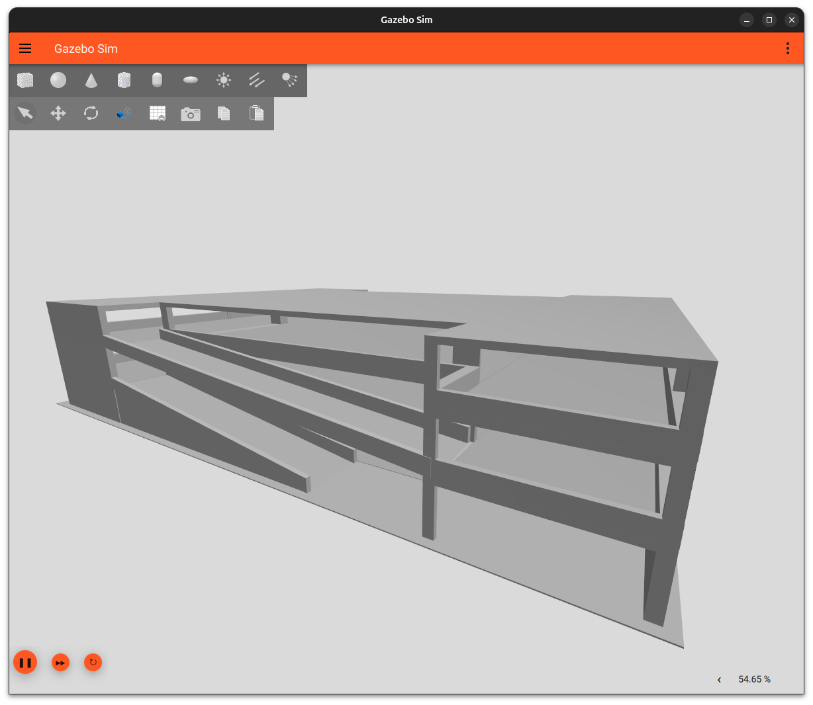
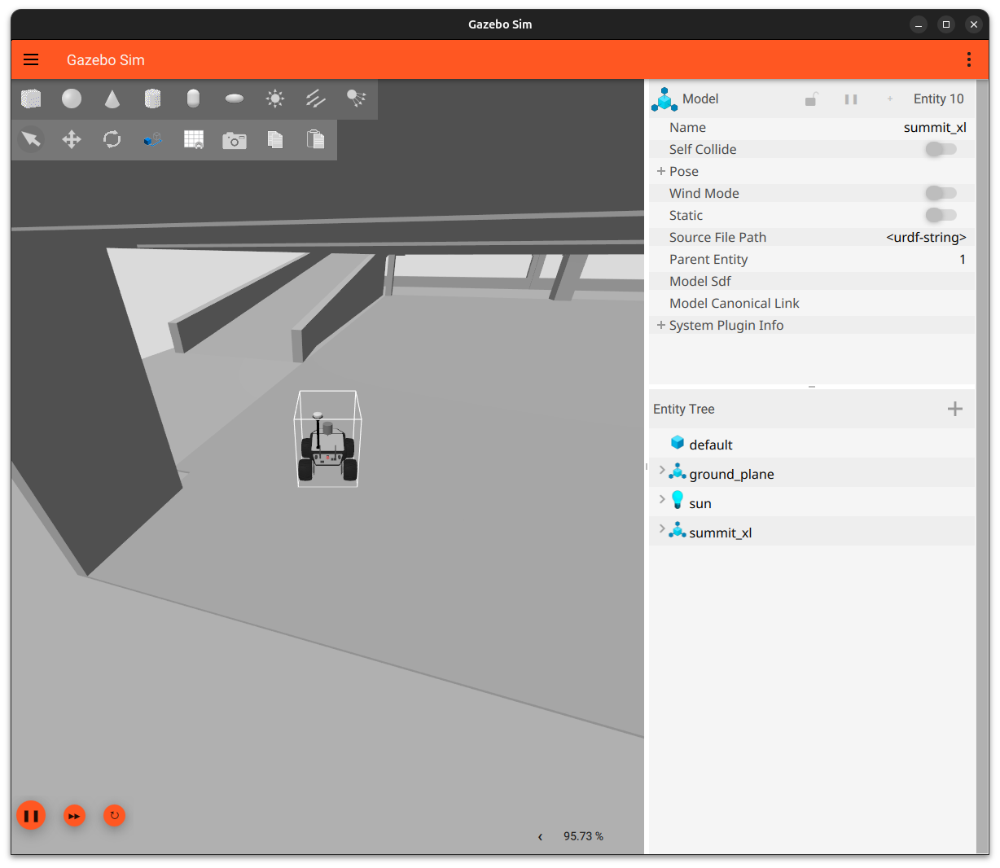
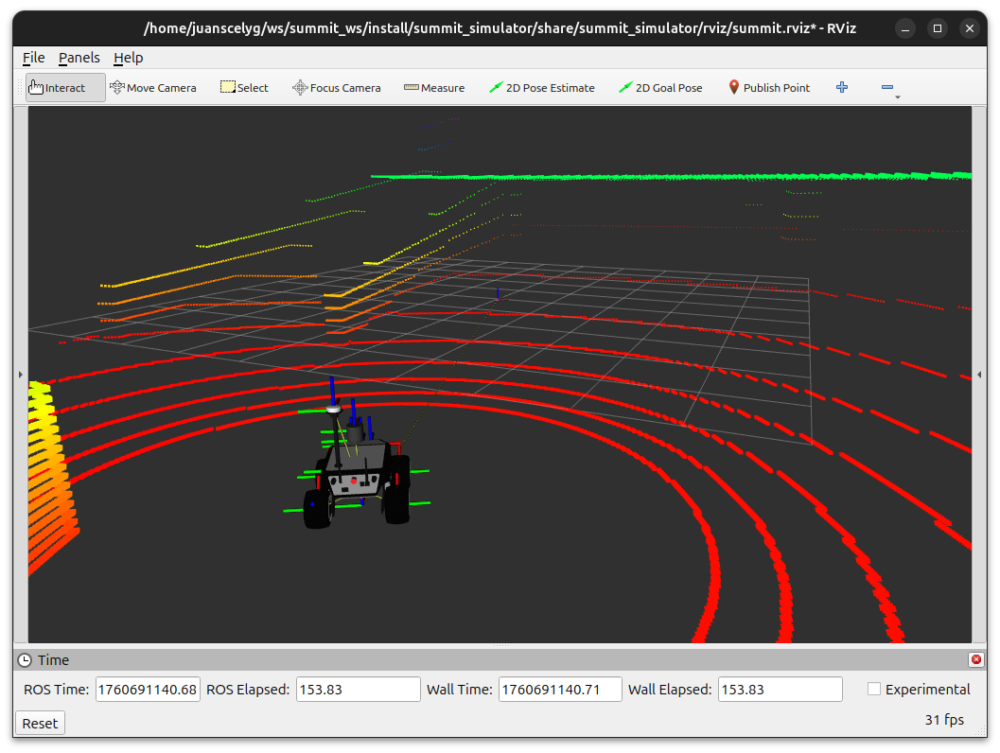

# Parking World World ROS package

The simulation enviroment is based on Parking Building designed by [michaelwjl](https://free3d.com/3d-model/paking-lot-182.html). This world could be used to create new algorithms in localization or navigation in 3D enviroments with more than one level.





## Include the world from another package

<!-- * Update .rosinstall to clone this repository and run `rosws update` -->
<!-- ```
- git: {local-name: src/urjc-excavation-world, uri: 'https://github.com/juanscelyg/urjc-excavation-world.git', version: main}
``` -->
* Add the following to your launch file:

```python
    urjc_excavation = launch.actions.IncludeLaunchDescription(
        launch.launch_description_sources.PythonLaunchDescriptionSource(
            os.path.join(
                get_package_share_directory('parking_garage_world'),
                'launch',
                'parking_garage.launch.py')))
```

## Load directly into Gazebo (without ROS)

```bash
export GAZEBO_MODEL_PATH=`pwd`/models
gz sim worlds/parking_garage.world
```

## ROS Launch with Gazebo viewer (without a robot)

```bash
# build for ROS
source /opt/ros/jazzy/setup.bash
source /usr/share/gazebo/setup.sh
rosdep install --from-paths . --ignore-src -r -y
colcon build

# run in ROS
source install/setup.sh
ros2 launch parking_garage_world parking_garage.launch.py
```

<!-- # Building
Include this as a .rosinstall dependency in your SampleApplication simulation workspace. `colcon build` will build this repository.

To build it outside an application, note there is no robot workspace. It is a simulation workspace only.

```bash
rosws update
rosdep install --from-paths . --ignore-src -r -y
colcon build
``` -->
